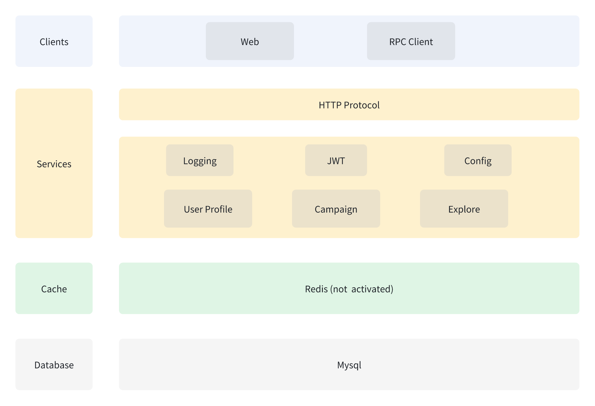

# `specification` of api

## Structure of api
here is the sturcture of api:

and, the detail of each api is in the following file:
- [structure](api-structure.md)

## Development tips

- API Usage: gin + gorm
- Main program entry: cmd/api-service

### Gin Initialization: internal/server
1. Initialize Gin to create an HTTP server.

### Global config parsing: config
1. `config.go` defaults to reading the `config.yaml` configuration from the current path.
2. The main program can specify a configuration file with `-c xxx.yaml`.

### API Router Addition Folder: internal/routers
1. Register routers according to the format in `routers.go`.
2. Add router paths according to the format.
3. Add router handlers according to the format.

### Router Handler Folder: internal/handler
1. Create a handler interface.
2. Implement the interface:
   1. Read API HTTP request parameters.
   2. Parse parameters.
   3. Interact with the database.

### Model Database Table Folder: internal/model
1. Create structs according to the gorm format.
2. Implement the `TableName() string` interface for gorm.
3. Refer to the official documentation (v2) for specific gorm tutorials.

### DB Implementation: internal/dbEntity
1. MySQL:
   1. Initialization.
   2. Interaction with gorm.
2. Redis:
   1. Initialization.
   2. Interaction with Redis.

### Middleware: internal/middleware
1. JWT
2. Logger
3. CORS
