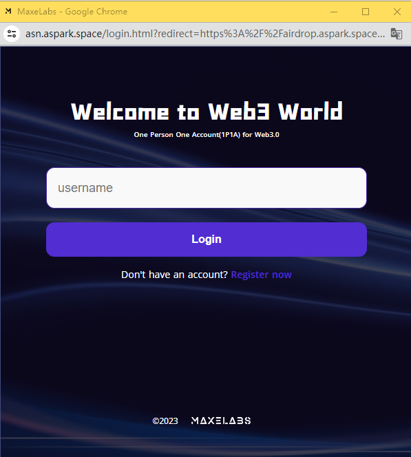
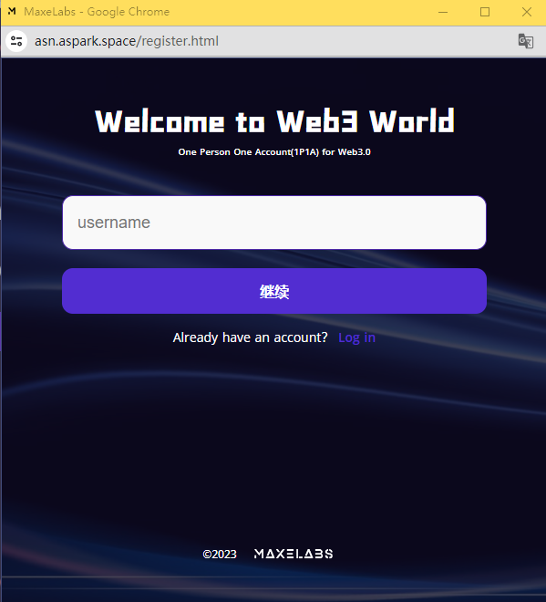

| API                         | Body                                                                                           | Response                                                                                                                                         | Description                                                                                                             |
|-----------------------------|------------------------------------------------------------------------------------------------|--------------------------------------------------------------------------------------------------------------------------------------------------|-------------------------------------------------------------------------------------------------------------------------|
| /api/diyRegister/start      | { "username": "abc" }                                                                         | { "publicKeyCredentialCreationOptions": { "Attestation": "none", "challenge": "fdsafds", "excludeCredentials": [], "pubKeyCredParams": {}, "rp": {}, "user": {}, "registrationId": "" } }  | Starts the user registration process, passing in the username to fetch information such as rpid from the backend.  |
| /api/diyRegister/finish     | { "credential": {}, "registrationId": "9Razrcs0MOxE1d/QEvBgqA==", "userAgent": "" }          | { "recoveryToken": "lOirBOSEM+n8ZPRrsf9ihg==" }                                                                                              | After successful FIDO authentication, returns to the backend to save the credential in the database.                 |
| /api/diyLogin/start        | { "username": "abc" }                                                                         | { "publicKeyCredentialCreationOptions": { "assertionId": "", "challenge": "fdsafds", "allowCredentials": [], "pubKeyCredParams": {}, "rpId": "" } } | Pulls challenge and user information from the backend and initiates an authentication request to the FIDO device.   |
| /api/diyLogin/finish       | { "credential": {}, "assertionId": "9Razrcs0MOxE1d/QEvBgqA==", "userAgent": "" }           | { "jwt": "", "username": "" }                                                                                                                 | Returns a JWT containing user information upon successful authentication.                                             |
| /api/userInfo              | GET Request                                                                                   | { "code": 1, "message": "", "data": { "address": "0x5ed83e34d22642b0d40efecb3284cf7dcde100f8", "fidoPublicKey": "...", "contractAddress": "0x9b8c8406f6ca90b23bdfe5750fc56263d386e851", "username": "huazheng3333" } } | Retrieves user information; this API must be called in a logged-in state, with JSESSIONID in cookies.                |
| /api/credential/list       | GET Request                                                                                   | { "code": 1, "message": "", "data": ["0xa401030339010020590100e98d4bf25748f209a8f2c34190413b0f64896254bb493d11c43cbfe4aa03f5a6a3180eaa2a23cdce4d6b22f95474c2f8aa5e458443516f66f360596b8a5c888085115745f394c0bc7ea485458b073b02ba8f5301a1be1932c607a1a6984c40d812481110d6686f1680bbc07603a0b8cab44903a1e6c8f27b712e64dc94f5a2922fec6ac5935af0ee0a9033fce20e427de9362cfdce8e5ab94fbc7867b8610bf9890a0037e8919b52fe20335c40c5a58a14c592c99f2c255db7a9952014fe2025dfa9eec0226e4ea02020ff35a204b1955484f5ca24ccb2126e30fbf3514bef23e87ee527516637e85b9c89edd9e1cd5cbc3ae580483b1c185db038db4c0ee86b2143010001"] } | Retrieves the current user's FIDO list; this API must be called in a logged-in state, with JSESSIONID in cookies.  |
| /api/diyRegister/add_start  | { "username": "abc" }                                                                         | { }                                                                                                                                              | This request process is the same as registration, but note that it must be called in a logged-in state, with JSESSIONID in cookies to bind to the current user.                  |
| /api/diyRegister/add_finish | { }                                                                                             | { }                                                                                                                                              | Same as the user registration completion process.                                                                       |

| API                          | Body                                                                                          | Response                                                                                                                                                   | Description                                                                                                               |
|------------------------------|-----------------------------------------------------------------------------------------------|------------------------------------------------------------------------------------------------------------------------------------------------------------|---------------------------------------------------------------------------------------------------------------------------|
| /api/credential/delete/start  | { "fidoId": "" }                                                                            | { }                                                                                                                                                        | Must be called in a logged-in state and specifies the specific FIDO ID to delete. The remaining process is similar to the login and registration flows.   |
| /api/credential/delete/finish | { }                                                                                          | { }                                                                                                                                                        | Completes the FIDO credential deletion process.                                                                                  |

Unlike the common FIDO registration, we have unified the user handle on the front end in webauthn-registration.js, ensuring that only one account is allowed per FIDO device on a website. The front-end code: s.user.id = "DEMO//9fX19ERU1P";

When authenticating during login, you need to add code in webauthn-login.js: cre.response.userHandle = s.userHandle;

login.html 

register.html 

The corresponding backend Java code for FIDO includes: Core files: controller/LoginController, controller/RegisterController, controller/CredentialController, HomeController, application.yaml (configuration for rpId and origin is done here)

The two main databases maintained by WebAuthn are jpa-webauthn-credential and jpa-webauthn-user.

Specific code operations can be found in the comments, which provide detailed explanations.

Important Points to Note:

If there are cross-origin issues, you need to configure the @CrossOrigin annotation for each of the controllers mentioned above, adding the allowed origins.
When configuring the WebAuthn rpId in application.yaml, note that the domain of the rpId must match that of the FIDO call. For instance, during local development, the rpId should be set to localhost; for a development environment, the rpId should match the corresponding domain, such as asn.aspark.space.
The origins configured in application.yaml must also include the domain calling FIDO.